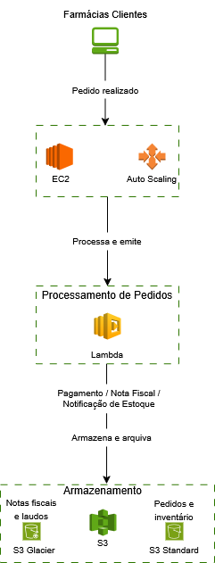

# Implementação de Serviços AWS — Desafio DIO

## 📋 Sobre o Desafio

Este projeto foi desenvolvido como entrega do desafio prático da plataforma [DIO (Digital Innovation One)](https://www.dio.me/).

O desafio propõe a concepção e o projeto de uma plataforma virtual para uma farmácia fictícia utilizando a infraestrutura da AWS. Ao enfrentar e resolver desafios semelhantes aos encontrados no mundo real, o objetivo é aprofundar o conhecimento sobre os serviços da AWS, aplicando conceitos teóricos em um cenário prático e dinâmico — servindo como porta de entrada para o mundo da computação em nuvem.

---

# Relatório de Implementação de Serviços AWS

**Data:** 27/05/2026  
**Empresa:** Absterso Industries  
**Responsável:** Nicolas Garcia Soto Maia  

---

## Introdução

Este relatório apresenta o processo de implementação de ferramentas na empresa Absterso Industries, realizado por Nicolas Garcia Soto Maia. O objetivo do projeto foi elencar 3 serviços AWS, com a finalidade de realizar diminuição de custos imediatos.

---

## Descrição do Projeto

O projeto de implementação de ferramentas foi dividido em 3 etapas, cada uma com seus objetivos específicos. A seguir, serão descritas as etapas do projeto:

### Etapa 1

- **Amazon S3 — Simple Storage Service**
- **Foco:** Armazenamento escalável em nuvem com pagamento conforme o uso
- **Caso de uso:** A farmacêutica utiliza o S3 para armazenar todos os seus dados operacionais — cadastro de clientes, detalhes de vendas, pedidos diários e controle de estoque. Além disso, documentos fiscais e laudos exigidos pela ANVISA, que precisam ser mantidos por anos, são arquivados no S3 Glacier, uma camada mais barata voltada para arquivos raramente acessados. Com isso, a empresa elimina o custo de compra de HD/SSD e para de pagar por espaço que não está usando, pagando apenas pelo volume de dados que realmente ocupa.

### Etapa 2

- **Amazon EC2 com Auto Scaling**
- **Foco:** Infraestrutura computacional elástica que escala automaticamente conforme a demanda, eliminando custos de servidores ociosos
- **Caso de uso:** A farmacêutica enfrenta picos de pedidos em períodos previsíveis — mudança de estações com aumento de resfriados, início de mês quando as farmácias clientes repõem estoque e fins de semana com maior movimento nas lojas. Com servidores locais de capacidade fixa, nesses momentos múltiplas farmácias clientes tentam acessar o sistema simultaneamente, gerando erros de acesso, pedidos não finalizados e risco de ruptura de contratos. Com EC2 e Auto Scaling, novas instâncias sobem automaticamente durante os picos e são desligadas quando a demanda cai — a empresa para de pagar por capacidade ociosa durante períodos tranquilos e para de perder vendas nos momentos de maior movimento.

### Etapa 3

- **AWS Lambda**
- **Foco:** Execução de tarefas automáticas sem servidor, com cobrança apenas por execução
- **Caso de uso:** A cada pedido realizado por uma farmácia cliente, uma série de processos precisa acontecer automaticamente validação da forma de pagamento, emissão de fatura, geração de nota fiscal, notificação do setor de separação de estoque e atualização do inventário. Com servidores locais, um sistema dedicado precisa ficar rodando continuamente para executar essas tarefas, gerando custo de energia e manutenção mesmo nos períodos sem pedidos. Com o Lambda, cada uma dessas tarefas vira uma função independente que é acionada automaticamente quando um pedido entra, executa e para a empresa paga apenas pelo tempo de processamento de cada função, eliminando o custo de infraestrutura ociosa entre os pedidos.

---

## Conclusão

A implementação de ferramentas na empresa Absterso Industries tem como esperado reduzir os custos imediatos e facilitar o gerenciamento das relações com farmácias parceiras, o que aumentará a eficiência e a produtividade da empresa. Recomenda-se a continuidade da utilização das ferramentas implementadas e a busca por novas tecnologias que possam melhorar ainda mais os processos da empresa.

---

## Anexos

### Diagrama de Arquitetura — Fluxo de Pedido na AWS

  

---

**Assinatura do Responsável pelo Projeto:**  
Nicolas Garcia Soto Maia
